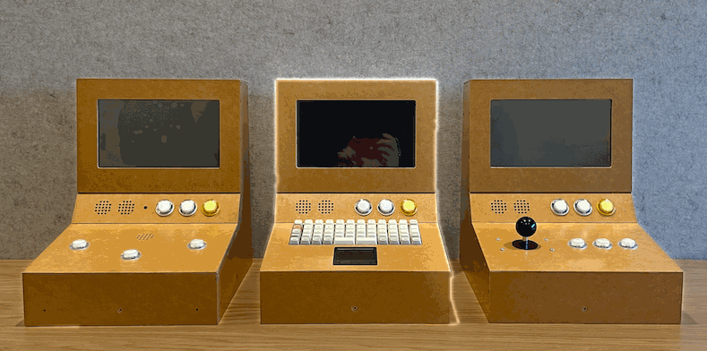
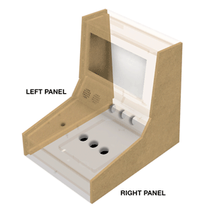

# creative-coding-cabinets

This repository contains files, parts lists, and instructions for creating
small arcade-style cabinets for displaying creative coding outcomes. I call
these cabinets 'Huey', 'Dewey', and 'Louie'.

This repository contains files and instructions for fabrication of the
cabinets. There is also a repository for a [Creative Coding Showcase], which
is stand-alone showcase application that can run on a raspberry pi to show
p5js creative coding sketches on the cabinets.

<table style="width: 100%; max-width: 740px; cell-padding: 0; border-collapse: collapse; border: 1px solid silver; padding: 0 12px;">
<thead style="background: silver;">
<th style="width: 33%;">
Huey: The ARTY cabinet
</th>
<th style="width: 33%;">
Dewey: The DATA cabinet
</th>
<th style="width: 33%;">
Louie: The PLAY cabinet
</th>
</thead>
<tbody>
<tr style="border: 1px solid silver;">
<td style="padding: 0 12px; border-right: 1px solid silver;">
Suited to interactive sound / art visualisations
</td>
<td style="padding: 0 12px; border-right: 1px solid silver;">
Suited to data exploration and interactive text experiences
</td>
<td style="padding: 0 12px;">
Suited to active game-like, or playful interactions
</td>
</tr>
<tr style="vertical-align: top;">
<td style="padding: 0 12px; border-right: 1px solid silver;">

<b>Inputs:</b> 
<ul style="margin-bottom: 0;">
<li>
Microphone
</li>
<li>
Web-camera
</li>
<li>
Three arcade buttons
</li>
</ul>

</td>
<td style="padding: 0 12px; border-right: 1px solid silver;">

<b>Inputs:</b> 
<ul style="margin-bottom: 0;">
<li>
Keyboard
</li>
<li>
Trackpad
</li>
<li>
Left + right mouse buttons
</li>
</ul>

</td>
<td style="padding: 0 12px;">

<b>Inputs:</b> 
<ul style="margin-bottom: 0;">
<li>
4-way joystick
</li>
<li>
Three arcade buttons
</li>
</ul>

</td>
</tr>
</tbody>
</table>

## CAD files

The latest version of the cabinets is available at the following link:

* <https://a360.co/44wea1F> (Fusion 360)

You can also find STLs and a fusion 360 archive file in the 'cad-files'
folder. Units are in millimeters.

## Panel Assembly

Panels should be CNC-routed from 16mm sheet stock. There are rebates around
the 'seams' to reduce the visible edges. This also assists with the assembly
because it helps the panels to fit together.

I used MDF for my cabinets, which is not the ideal material for this
application. A good quality plywood would be better. But I gave the MDF a
couple of layers of clear-coat varnish to protect it and it has mostly been
ok.

Assembly is as shown in the following animation. Note that you'll need to
choose which input panel and splash panel to fabricate depending on which
cabinet you're making. The 'Huey' cabinet's splash panel has a small hole for
the raspberry pi camera to be mounted. Alternatively, you can just use a
webcam and sit it on top of the cabinet.

Holes for fasteners will be pre-drilled in the side panels from the CNC router.
You will also have to drill holes into the receiving MDF panels so they don't
split when you drive the screws in. I also manually added a countersink.

The base hatch attaches to the base panel with two hinges and has a hole for
installing an 18mm drawer lock.

## Hardware installation

### Raspberry pi mount

The raspberry pi mounts to the bottom hatch panel so that you can easily
access the pi by swinging out the hatch. It is designed to be 3D printed in
PLA or similar. The mounting plate will fit a raspberry pi 4, or 5
layout.

The mounting plate has two 'whiskers' printed on it that assist positioning it
on the hatch plate. align the ends of these with the opening end of the hatch
and there should be enough room for even large HDMI cables to be routed out fo
the little hole cut in the corner.

There are six screws for the bottom plate that screw directly to the
base hatch. Then the covering plates fasten down onto the base plate with six
more screws.

### Monitor installation

There are some mounting plates for the monitor specified above. These can be
laser cut from 3mm MDF and mounted on the inside of the monitor panel. Pilot
holes will have to be drilled into the back of the monitor panel to receive
the screws. The monitor can be mounted with the HDMI connector facing down,
which makes installation easier, but means that the display needs to be
flipped in raspberry pi. 

If a second monitor is needed (e.g. a projector) then it's probably easier to
mount the monitor so the HDMI connectors face up. This will require a bit of
cable-twisting on the HDMI connectors to fit them into the space, but there
should be enough with the rebate that is provided on the underside of the top
panel. 

If you use a different monitor, design and laser cut a suitable mounting
plate. The monitor opening may also need to be tweaked for size.

### Keyboard and trackpad

For the 'Dewey' cabinet, the keyboard and trackpad mount through the base of
the keyboard input panel. Similar to the monitor, mounting plates laser cut
from 3mm MDF are used for this. Adjust the dimensions if you are using
different hardware.

### Arcade buttons and joystick

The arcade buttons and joystick are simple to install by using the provided
attachment bolts. I found that the cables I bought were a little too short for
the hatch to open all the way, so I cut and soldered them longer.

### Pi Camera

*(**NOTE:** I have not yet been able to get the raspberry pi camera to work with
chromium on the raspberry pi as a webcam. From the small amount of searching I
did, it seemed like this might be possible, but I haven't had time. Instead,
I've used a regular webcam plugged in to usb and that worked fine.)*

The 'Huey' cabinet uses a raspberry pi camera module. This is mounted with a
laser cut mounting board to the back of the splash plate. It connects to the
raspberry pi with a ribbon cable. Make sure that the cable is long-enough to
reach when the hatch is open. I got a 500mm cable and it was ok.

Also note that if you're using a raspberry pi 5, you will need a different ribbon
cable than a raspberry pi 4.

### Misc hardware

Some cable tidies to keep things organized inside.

## License

Shield: [![CC BY-NC-SA 4.0][cc-by-nc-sa-shield]][cc-by-nc-sa]

This work is licensed under a
[Creative Commons Attribution-NonCommercial-ShareAlike 4.0 International License][cc-by-nc-sa].

[![CC BY-NC-SA 4.0][cc-by-nc-sa-image]][cc-by-nc-sa]

[cc-by-nc-sa]: http://creativecommons.org/licenses/by-nc-sa/4.0/
[cc-by-nc-sa-image]: https://licensebuttons.net/l/by-nc-sa/4.0/88x31.png
[cc-by-nc-sa-shield]: https://img.shields.io/badge/License-CC%20BY--NC--SA%204.0-lightgrey.svg

[Creative Coding Showcase]: https://github.com/awarua/creative-coding-showcase